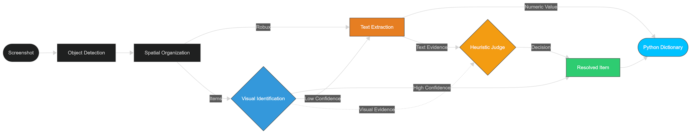

# Proofreader 🔍

A high-speed vision pipeline for reading Roblox trade screenshots.


Proofreader transforms unstructured screenshots of Roblox trades ("proofs", hence "proofreader") into structured Python dictionaries. By combining **YOLOv11** for object detection, **CLIP** for visual similarity, and **EasyOCR**, it achieves high accuracy across diverse UI themes, resolutions, and extensions.

## Why Proofreader?

Roblox trade screenshots are commonly used as proof in marketplaces, moderation workflows, and value analysis, yet they are manually verified and error-prone. Proofreader automates this process by converting screenshots into structured, verifiable data in milliseconds.


## Example

<table>
<tr>
<td>
<b>Input Image</b><br>
<br><br>
<b>Detected UI Elements</b><br>

</td>
<td>
<b>Sample Output JSON</b>
<pre><code class="language-json">{
    "outgoing": {
        "item_count": 4,
        "robux_value": 0,
        "items": [
            {"id": 1031429, "name": "Domino Crown"},
            {"id": 72082328, "name": "Red Sparkle Time Fedora"},
            {"id": 124730194, "name": "Blackvalk"},
            {"id": 16652251, "name": "Red Tango"}
        ]
    },
    "incoming": {
        "item_count": 2,
        "robux_value": 1048576,
        "items": [
            {"id": 21070012, "name": "Dominus Empyreus"},
            {"id": 22850569, "name": "Red Bandana of SQL Injection"}
        ]
    }
}
</code></pre>
</td>
</tr>
</table>


## ⚡ Performance

Tested on an **RTX 5070** using $n=500$ real-world "worst-case" user screenshots (compressed, cropped, and varied UI).

| Metric                  | Result (E2E)                |
|:------------------------|:----------------------------|
| Exact Match Accuracy    | 97.2% (95% CI: 95.4–98.5%)  |
| Median latency          | 36.8 ms                     |
| 95th percentile latency | 73.4 ms                     |

> [!NOTE]
> End-to-End **(E2E)** latency includes image loading, YOLO detection, spatial organization, CLIP similarity matching, and OCR fallback.

## ✨ Key Features

- **Sub-40ms Latency:** Optimized with "Fast-Path" logic that skips OCR for high-confidence visual matches, ensuring near-instant processing.

- **Multi-modal decision engine:** Weighs visual embeddings against OCR text to resolve identities across 2,500+ distinct item classes.

- **Fuzzy Logic Recovery:** Built-in string distance matching corrects OCR typos and text obscurations against a local asset database.

- **Theme & Scale Agnostic:** Robust performance across various UI themes (Dark/Light), resolutions, and custom display scales.

## 💻 Quick Start

### Installation

```bash
pip install rbx-proofreader
```

> [!IMPORTANT]
> **Hardware Acceleration:** Proofreader automatically detects NVIDIA GPUs. For sub-40ms performance, ensure you have the CUDA-enabled version of PyTorch installed. If a CPU-only environment is detected on a GPU-capable machine, the engine will provide the exact `pip` command to fix your environment.

### Usage

```py
import proofreader

# Extract metadata from a screenshot
data = proofreader.get_trade_data("trade_proof.png")

print(f"Items Out: {data['outgoing']['item_count']}")
print(f"Robux In: {data['incoming']['robux_value']}")
```

> [!TIP]
> **First Run:** On your first execution, Proofreader will automatically download the model weights and item database (~360MB). Subsequent runs will use the local cache for maximum speed.

## 🧩 How it Works
The model handles the inconsistencies of user-generated screenshots (varied crops, UI themes, and extensions) through a multi-stage process:

1. **Detection:** YOLOv11 localizes item cards, thumbnails, and robux containers.

2. **Spatial Organization:** Assigns child elements (names/values) to parents and determines trade side.

3. **Identification:** CLIP performs similarity matching. High-confidence results become Resolved Items immediately.

4. **Heuristic Judge:** Low-confidence visual matches trigger OCR and fuzzy-logic reconciliation.



## 📊 Data Schema
The `get_trade_data()` function returns a structured dictionary containing `incoming` and `outgoing` trade sides.

| Key | Type | Description |
| :--- | :--- | :--- |
| `item_count` | `int` | Number of distinct item boxes detected. |
| `robux_value` | `int` | Total Robux parsed from the trade. |
| `items` | `list` | List of `ResolvedItem` objects containing `id` and `name`. |

**ResolvedItem Schema:**

| Property | Type | Description |
| :--- | :--- | :--- |
| `id` | `int` | The official Roblox Asset ID. |
| `name` | `str` | Canonical item name from the database. |

## 🏗️ Development & Training
To set up a custom training environment for the YOLO and CLIP models:

```bash
# 1. Clone and Install
git clone https://github.com/lucacrose/proofreader.git
cd proofreader
pip install -e ".[train]"

# 2. Initialize Database
python scripts/setup_items.py

# 3. Training
# Place backgrounds in src/proofreader/train/emulator/backgrounds
# Place HTML templates in src/proofreader/train/emulator/templates
python scripts/train_models.py
```

> [!CAUTION]
> **GPU Required:** Training is not recommended on a CPU. Final models save to `runs/train/weights/best.pt`. Rename to `yolo.pt` and move to `src/assets/weights`.

## 🛠️ Tech Stack

- **Vision:** YOLOv11 (Detection), CLIP (Embeddings), OpenCV (Processing)
- **OCR:** EasyOCR
- **Logic:** RapidFuzz (Fuzzy String Matching)
- **Core:** Python 3.12, PyTorch, NumPy

## 🤝 Contributing

Contributions are welcome! Please open an issue or submit a pull request.

## 📜 License

This project is licensed under the MIT License.